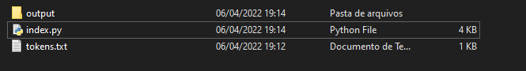
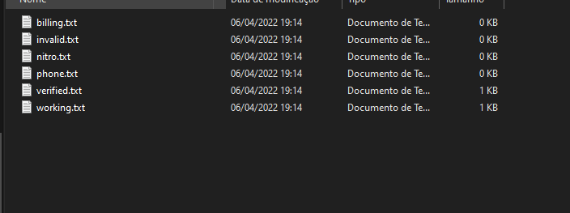
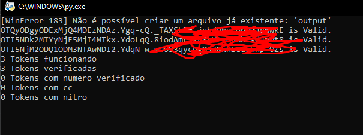

<h1>token-checker filtrando as tokens</h1>

### status: em desenvolvimento

## o token-checker armazena:

+ tokens com cc
+ tokens invalida
+ tokens com nitro
+ tokens com numero verificado
+ tokens verificada no caso pega as invalida tambem
+ e as token funcionando

prints:

### arquivos

### arquivos de token

### print terminal

